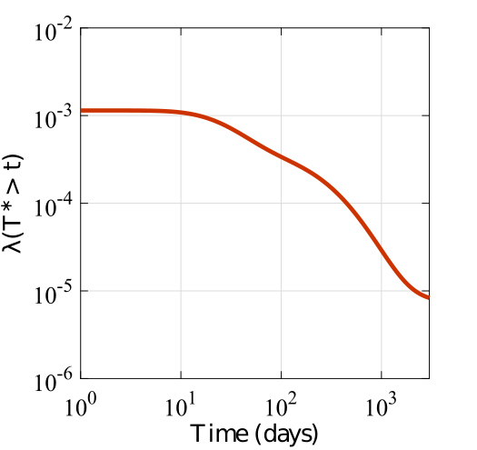

This repo consists of the codes used for a paper titled ''*Disfunctionality Hazard: Decision Tool for Resilience-Based Design of Systems under Single Hazards and Temporally Dependent Multihazards*.''

# Overview of the paper

This paper proposes a novel resilience metric termed Disfunctionality hazard for supporting resilience-based decision making of systems subjected to hazards. Disfunctionality hazard maps a system's functionality recovery curves to a risk space that is similar to the performance-based engineering framework. Specifically, Disfunctionality hazard is defined as the frequency of exceedance of a time to full recovery. It is mathematically defined as:

 t) = \int P(T^* > t|IM) |dIM|">

where,  is the time to full recovery,  is the conditional probability of exceedance of a time to full recovery, and  is the hazard intensity measure. The above definition of the Disfunctionality hazard applies to the case of a system subjected to a single hazard. It can, however, be extended to the case of multihazards with temporal interdependencies. More discussion is provided in the paper. The figure below presents the Disfunctionality hazard. To summarize, Disfunctionality hazard is a resilience-based decision making tool that maps standard recovery curves from the functionality space to the risk space, while considering all possible realizations of the hazards intensities and their temporal interdependencies.

# Description of the code

In this repo, MATLAB codes are provided to:

* Simulate system functionality recovery curves using Markov-type processes for three, four, and five functionality states.
* Simulate functionality recovery curves for single hazards and multihazards with temporal interdependencies.
* Convert functionality recovery curves to the Disfunctionality hazard.

# Organization of the code

# References
 [1] Dhulipala, S. L., & Flint, M. M. (2020). Series of semi-Markov processes to model infrastructure resilience under multihazards. *Reliability Engineering & System Safety*, 193, 106659.
