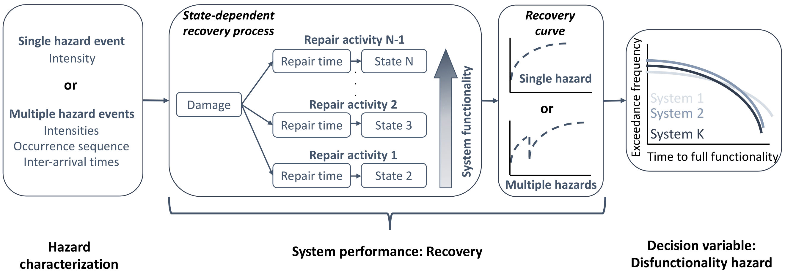

This repo consists of the codes used for a paper titled ''*DISFUNCTIONALITY HAZARD: A RISK-BASED TOOL TO SUPPORT THE RESILIENT DESIGN OF SYSTEMS SUBJECTED TO SINGLE HAZARDS AND MULTIHAZARDS*.''

# Overview of the paper

This paper proposes a novel resilience metric termed Disfunctionality hazard for supporting resilience-based decision making of systems subjected to hazards. Disfunctionality hazard maps a system's functionality recovery curves to a risk space that is similar to the performance-based engineering framework. Specifically, Disfunctionality hazard is defined as the frequency of exceedance of a time to full recovery. It is mathematically defined as:

 t) = \int P(T^* > t|IM) |dIM|">

where,  is the time to full recovery,  is the conditional probability of exceedance of a time to full recovery, and  is the hazard intensity measure. The above definition of the Disfunctionality hazard applies to the case of a system subjected to a single hazard. It can, however, be extended to the case of multihazards with temporal interdependencies. More discussion is provided in the paper. The figure below presents the Disfunctionality hazard. To summarize, Disfunctionality hazard is a resilience-based decision making tool that maps standard recovery curves from the functionality space to the risk space, while considering all possible realizations of the hazards intensities and their temporal interdependencies. The figure below presents a schematic of the procedure for computing the disfunctionality hazard.

# Description of the code

In this repo, MATLAB codes are provided to:

* Simulate system functionality recovery curves using Markov-type processes for three functionality states under single hazards.
* Simulate functionality recovery curves for multihazards with temporal interdependencies.
* Convert functionality recovery curves to the Disfunctionality hazard.

# Repo contents

* [Damage_Earthquakes_Li_Ell.m](https://github.com/somu15/Disf_Hazard/blob/devel/Codes/Damage_Earthquakes_Li_Ell.m) and [Damage_Hurr_Li_Ell.m](https://github.com/somu15/Disf_Hazard/blob/devel/Codes/Damage_Hurr_Li_Ell.m) compute the damage functions
for the wooden building.
* [Rep_dists_Li_Ell_Eq_Char_SMPRESS.m](https://github.com/somu15/Disf_Hazard/blob/devel/Codes/Rep_dists_Li_Ell_Eq_Char_SMPRESS.m) and [Rep_dists_Li_Ell_Hurr_Char_SMPRESS.m](https://github.com/somu15/Disf_Hazard/blob/devel/Codes/Rep_dists_Li_Ell_Hurr_Char_SMPRESS.m) compute the transition time
distributions for the wooden building.
* [Same_Resilience.m](https://github.com/somu15/Disf_Hazard/blob/devel/Codes/Same_Resilience.m) computes the disfunctionality hazard for recovery curves having the
same resilience value.
* [Simulate_3state_rec.m](https://github.com/somu15/Disf_Hazard/blob/devel/Codes/Simulate_3state_rec.m) computes the functionality recovery curve for a system
with three recovery states under single hazards.
* [Simulate_MH_rec.m](https://github.com/somu15/Disf_Hazard/blob/devel/Codes/Simulate_MH_rec.m) computes the functionality recovery curve for a system
with three recovery states under multihazards.

# References
 [1] Dhulipala, S. L. N. & Flint, M. M. (2020). Series of semi-Markov processes to model infrastructure resilience under multihazards. *Reliability Engineering & System Safety*, 193, 106659.

 [2] Dhulipala, S. L. N., Burton, H. V. & Baroud, H. (2020). A Markov framework for generalized post-event systems recovery modeling: From single to multihazards. [Under review].
